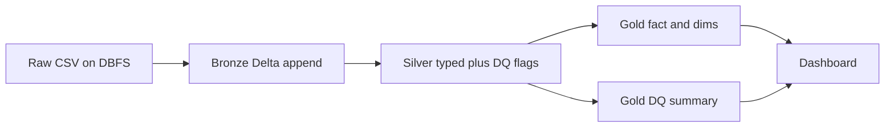

# Design Notes

Architecture: Bronze (raw) → Silver (conformed + flagged) → Gold (BI) → Dashboard. Runtime: Databricks Community Edition, PySpark, Delta Lake.

## Path layout

```
/dbfs/tmp/medallion/
  bronze/{customers,products,orders,order_items}
  silver/{customers,products,orders,order_items}
  gold/{dim_customer,dim_product,fct_order_line,kpi_daily_sales,kpi_product_performance,dq_summary}
```

Config owns these paths (`conf/`). Notebooks call `src/` functions; they do not embed OS-local paths.

```
docs/                 architecture and assessment write-ups
conf/                 path and job parameters
data/raw/             source file contract / samples (not secrets)
schemas/              explicit StructType definitions
src/common/           spark helpers, logging, path resolution
src/bronze/           ingest + metadata
src/silver/           clean, DQ flags, dedupe
src/gold/             facts, dims, KPIs
src/quality/          four check families + error-code catalog
notebooks/            runnable Databricks entrypoints per layer
sql/dashboard/        BI queries over Gold
tests/                DQ count and schema tests
dashboards/           dashboard definition notes / export
```

## Bronze

**Purpose:** durable raw landing. Preserve source strings/values; add lineage only.

**Read:** `spark.read.schema(BRONZE_SCHEMA).option("header", True).csv(input_path)`  
All source fields stored as `StringType` (or the documented raw type) so type defects survive into Silver.

**Metadata (required):**

- `_ingested_at` — `current_timestamp()`
- `_source_file` — `input_file_name()`

**Write:** Delta, `mode("append")`. Partition optional (`_ingested_at` date) if it does not break CE jobs.

**Out of scope at Bronze:** casting, dropping, dedupe, DQ flags (flags belong in Silver so raw history stays untouched).

## Silver

**Purpose:** typed, conformed, complete set of rows including failures.

1. Read Bronze Delta.
2. Trim strings; treat `""` and `"null"` (case-insensitive) as NULL.
3. Cast with explicit schemas (`IntegerType`, `DecimalType`, `DateType`, `TimestampType`, …). Failed casts become NULL and a Type/Business code.
4. Run the four DQ families (`src/quality`).
5. Set `quality_check_result` to `PASS` or `FAIL`, plus `quality_error_codes` (semi-colon separated, stable order).
6. Deduplicate: keep one survivor per business key (latest `_ingested_at`); mark extras `UNIQ_DUPLICATE_PK`. Survivors that are duplicates still fail Uniqueness.
7. Write Delta `overwrite` (full batch rebuild) to keep CE operations simple and idempotent.

Invalid rows **remain in Silver**. Gold KPIs filter `quality_check_result = 'PASS'` (or equivalent) so BI is clean without deleting evidence.

## Gold

**Purpose:** star-schema-ish analytics tables, PASS rows for measures, plus an unfiltered DQ mart.

| Table | Grain | Source | Notes |
| --- | --- | --- | --- |
| `gold_dim_customer` | `customer_id` | Silver customers PASS | Current attributes |
| `gold_dim_product` | `product_id` | Silver products PASS | Category, price list |
| `gold_fct_order_line` | order line | Silver items ⋈ orders ⋈ customers ⋈ products | Only lines where driving keys pass; optional `_is_dq_excluded` |
| `gold_kpi_daily_sales` | `order_date` | Fact | `order_count`, `item_count`, `gross_revenue`, `aov` |
| `gold_kpi_product_performance` | `product_id` | Fact | `units`, `revenue` |
| `gold_dq_summary` | entity + check_family + error_code | All Silver | Counts; planted total = 700 |

Aggregations use Spark SQL / DataFrame `groupBy`. No pandas.

## Dashboard

Databricks SQL or notebook charts against Gold only.

| View | Question | Table |
| --- | --- | --- |
| Sales overview | Revenue, orders, AOV by day | `gold_kpi_daily_sales` |
| Product mix | Top products/categories | `gold_kpi_product_performance` |
| DQ scorecard | 700 defects by family and code | `gold_dq_summary` |
| Pipeline health | PASS vs FAIL row counts by entity | `gold_dq_summary` |

SQL lives in `sql/dashboard/`. Visual layout notes live in `dashboards/`.

## Data flow



## Logging contract

Each notebook prints: layer name, table, input count, output count, FAIL count, write path. Gold DQ job prints counts per check family and the grand total (expected 700).
